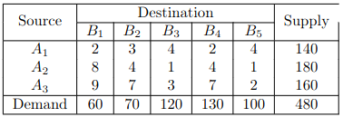
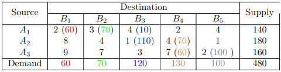

# Implementation of Interior-Point algorithm

### Content

- [Installation](#installation)
- [Usage](#usage)
- [Example](#example)
- [License](#license)

## Installation

Install python version 3.11+. Make sure to add python to `PATH`.

Using command line, go to the repo folder (`.../simplex/`).

Run following commands:

```bash
pip3.11 install poetry
poetry install
```

The package `poetry` will automatically install dependencies for project. If it's not you can follow other instructions from [official website](https://python-poetry.org/docs/).

## Usage

To run main program, use the following:

```bash
poetry run python -m src
```

### Input format
Solves the Transportation problem in the following form:

#### Objective function:

The objective function is to minimize the total transportation cost minimize

$$
Z = \sum_{i=1}^{m} \sum_{j=1}^{n} c_{ij} \cdot x_{ij}
$$

Where:

- $c_1 \ \ c_2 \ \ ... \ \ c_n$ are coefficients associated with decision variables $x_1 \ \ x_2 \ \ ... \ \ x_n$
- $x_1 \ \ x_2 \ \ ... \ \ x_n$ are the decision variables to be determined.

#### Subjected to the following constraints:

**Supply constraints**:

$$
\sum_{j=1}^{n} x_{ij} = S_i
$$
for $i = 1, 2, ... m$

**Demand constraints**:

$$
\sum_{j=1}^{m}x_{ij} = D_i
$$
for $j = 1, 2, ... n$


**Non-negativity constraints:** $x_{ij} \geq 0$, for $i = 1, 2, ...,m$ and $j = 1, 2, ..., n$


Where:
- $S_i$: Supply at supplier $i$
- $D_j$:  Demand at consumer $j$
- $c_{ij}$: Cost of transporting one unit from supplier $i$ to consumer $j$
- $x_{ij}$: Quantity of goods transported from supplier $i$ to consumer $j$


### Output Format

The output format is provided in the Solution class, which includes:

Output:
- Optimum of objective function $f(x)$
- Sequence of paths in the table to acphieve optimum

## Example

### Given
Linear Transportation problem as follows:


### Result:

Solved using The Northwest Corner Rule:


* Total cost = 2 * 60 + 3 * 70 + 4 * 10 + 1 * 110 + 4 * 70 + 7 * 60 + 2 * 100 = 1380

### Full input and output:
```
Enter the number of supplies (default: 3):

Enter the number of demands (default: 4):
5
Enter Supplies (separate by whitespace, 3 float coefficients):
140 180 160
Enter Demands (separate by whitespace, 5 float coefficients):
60 70 120 130 100
Enter distribution unit cost for supply 0 (separate by whitespace, 5 float coefficients):
2 3 4 2 4
Enter distribution unit cost for supply 1 (separate by whitespace, 5 float coefficients):
8 4 1 4 1
Enter distribution unit cost for supply 2 (separate by whitespace, 5 float coefficients):
9 7 3 7 2
Enter the method of transportation problem (`northwest`, `vogel`, `russel`, or just Enter for `northwest`):

Solution:
Cost = 1380.0
Choices:
60.0 from S1 to D1
70.0 from S1 to D2
10.0 from S1 to D3
110.0 from S2 to D3
70.0 from S2 to D4
60.0 from S3 to D4
100.0 from S3 to D5
```


## License

Solver is available under the MIT license. See the LICENSE file for more info.
